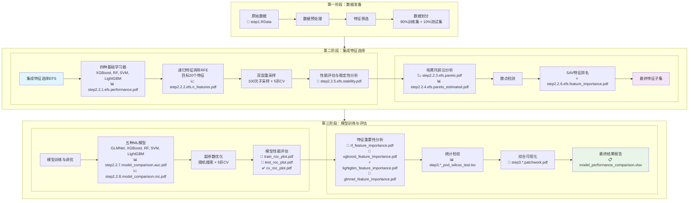
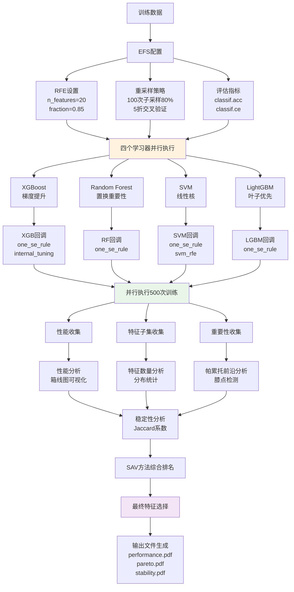
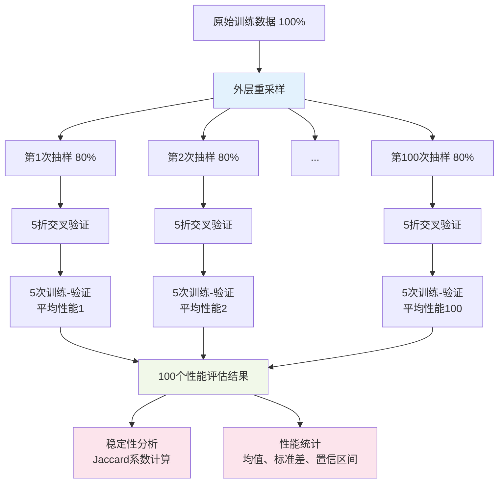
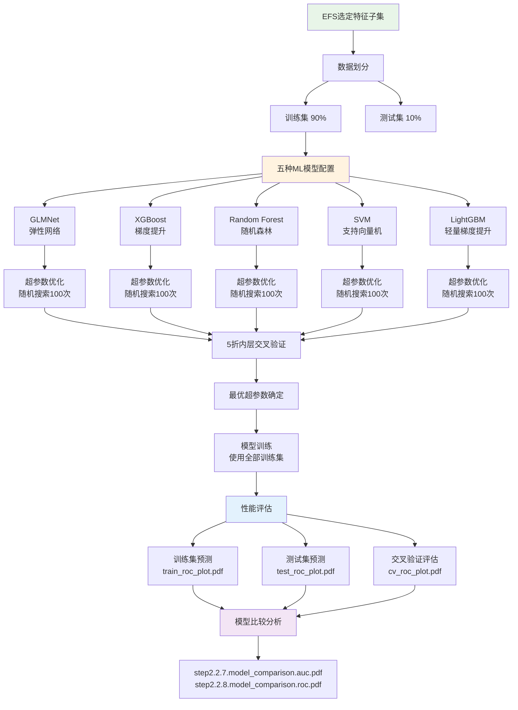
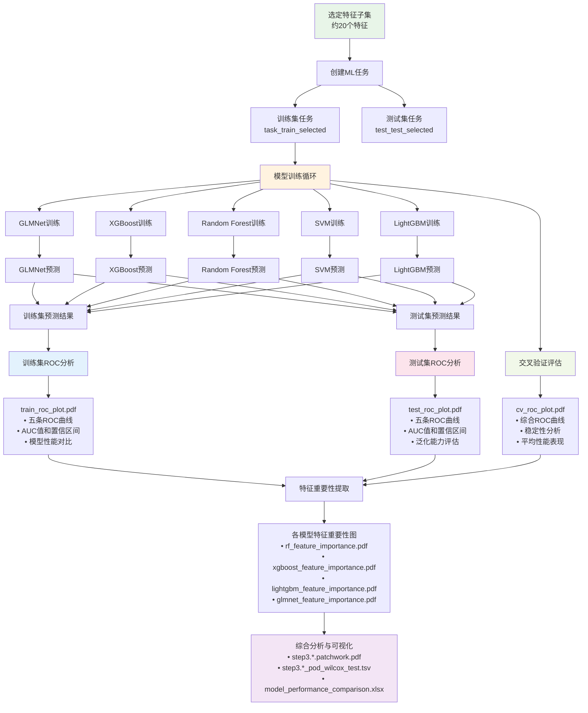

# MLR3集成特征选择(EFS)完整教程

## 目录
1. [概述](#1-概述)
2. [流程图](#2-流程图)
3. [整体流程](#3-整体流程)
4. [集成特征选择(EFS)详解](#4-集成特征选择efs详解)
5. [结果分析与解释](#5-结果分析与解释)
6. [最佳实践与建议](#6-最佳实践与建议)

---

## 1. 概述

本教程基于MLR3框架，详细介绍了如何使用集成特征选择(Ensemble Feature Selection, EFS)方法进行机器学习建模。该方法结合了多个不同的学习算法来选择最优特征子集，相比单一算法具有更好的稳定性和泛化能力。

### 1.1 主要特点
- **多算法集成**: 结合XGBoost、Random Forest、SVM、LightGBM四种算法
- **稳定性保证**: 通过多次重采样和Jaccard系数评估特征选择稳定性
- **自动化程度高**: 自动膝点检测、特征排名、性能评估
- **可解释性强**: 提供详细的可视化分析和特征重要性解释

---

## 2. 流程图

### 2.1 整体流程图



### 2.2 EFS详细流程图



### 2.3 双层重采样机制图



### 2.4 模型训练与评估流程图



### 2.5 训练与测试详细步骤图



---

## 3. 整体流程

### 3.1 流程概览

```
数据准备 → 集成特征选择(EFS) → 模型训练调优 → 模型评估 → 特征重要性分析 → 综合分析
   ↓              ↓                ↓            ↓           ↓              ↓
step1.RData   step2.2.1-6.pdf   step2.2.7-8.pdf  train/test/   rf/xgb/lgbm/   step3.*.pdf
                                                   cv_roc_plot.pdf  glmnet_importance.pdf  *.xlsx
```

### 3.2 详细步骤

#### 3.2.1 数据准备阶段
- **输入数据**: 从`step1.RData`加载预处理的数据
- **特征筛选**: 排除`feature58`, `feature27`, `feature26`和tNGS相关特征
- **数据预处理**: 
  - 连续变量使用历史插补(`imputehist`)
  - 分类变量使用众数插补(`imputemode`)
  - 移除常数特征(`removeconstants`)
- **数据划分**: 90%训练集，10%测试集

#### 3.2.2 集成特征选择(EFS)阶段
- **特征选择器**: 递归特征消除(RFE)，目标20个特征，特征比例85%
- **基础学习器**: XGBoost, Random Forest, SVM, LightGBM
- **重采样**: 100次子采样(80%比例) + 5折交叉验证
- **输出文件**:
  - `step2.2.1.efs.performance.pdf`: 不同学习器性能比较 📊
  - `step2.2.2.efs.n_features.pdf`: 选择的特征数量分布 📈
  - `step2.2.3.efs.pareto.pdf`: 经验帕累托前沿 📉
  - `step2.2.4.efs.pareto_estimated.pdf`: 估计帕累托前沿 📊
  - `step2.2.5.efs.stability.pdf`: 特征选择稳定性 🎯
  - `step2.2.6.efs.feature_importance.pdf`: EFS特征重要性 ⭐

#### 3.2.3 模型训练与调优阶段
- **模型**: GLMNet, XGBoost, Random Forest, SVM, LightGBM
- **超参数优化**: 随机搜索，5折内层交叉验证
- **性能评估**: 5折外层交叉验证
- **输出文件**:
  - `step2.2.7.model_comparison.auc.pdf`: 五种模型AUC性能箱线图比较，显示每个模型在5折交叉验证中的AUC分布、中位数、四分位数和异常值 📊
  - `step2.2.8.model_comparison.roc.pdf`: 五种模型的ROC曲线叠加图，展示各模型的敏感性-特异性权衡关系和整体判别能力 📈

#### 3.2.4 模型评估阶段
- **训练集评估**: 
  - `train_roc_plot.pdf`: 五种模型在训练集上的ROC曲线对比，包含AUC值和95%置信区间，用于评估模型在训练数据上的拟合效果 🚂
- **测试集评估**: 
  - `test_roc_plot.pdf`: 五种模型在独立测试集上的ROC曲线对比，包含AUC值和95%置信区间，评估模型的泛化能力和实际预测性能 🧪
- **交叉验证评估**: 
  - `cv_roc_plot.pdf`: 五种模型在5折交叉验证中的综合ROC曲线，展示模型在不同数据划分下的稳定性和平均性能表现 ✅

#### 3.2.5 特征重要性分析阶段
- **各模型特征重要性**:
  - `rf_feature_importance.pdf` 🌳
  - `xgboost_feature_importance.pdf` 🚀
  - `lightgbm_feature_importance.pdf` ⚡
  - `glmnet_feature_importance.pdf` 🎯

#### 3.2.6 综合分析阶段
- **统计检验**: 
  - `step3.glmnet_pod_wilcox_test.tsv`: GLMNet模型预测概率的Wilcoxon秩和检验结果，比较阳性和阴性样本的预测概率分布差异 📊
  - `step3.rf_pod_wilcox_test.tsv`: 随机森林模型的统计检验结果，评估模型判别能力的统计显著性 📊
  - `step3.xgboost_pod_wilcox_test.tsv`: XGBoost模型的统计检验结果，量化模型预测的统计学意义 📊
  - `step3.lightgbm_pod_wilcox_test.tsv`: LightGBM模型的统计检验结果，验证模型分类效果的可靠性 📊
  - `step3.svm_pod_wilcox_test.tsv`: SVM模型的统计检验结果，评估支持向量机的分类性能显著性 📊
- **综合可视化**: 
  - `step3.glmnet.patchwork.pdf`: GLMNet模型的综合分析图，包含ROC曲线、预测概率箱线图和特征重要性图的组合展示 🎨
  - `step3.rf.patchwork.pdf`: 随机森林模型的多面板可视化，展示模型性能、预测分布和特征贡献的完整图景 🎨
  - `step3.xgboost.patchwork.pdf`: XGBoost模型的综合分析面板，整合性能评估、概率分布和特征重要性分析 🎨
  - `step3.lightgbm.patchwork.pdf`: LightGBM模型的多维度可视化分析，提供模型表现的全方位视图 🎨
  - `step3.svm.patchwork.pdf`: SVM模型的综合展示图，包含分类性能和预测概率分布的详细分析 🎨
- **性能汇总**: 
  - `model_performance_comparison.xlsx`: 包含所有模型在交叉验证、训练集和测试集上的详细性能指标(AUC、准确率、分类误差)，以及超参数配置和特征重要性排名的综合Excel报告 📋

---

## 4. 集成特征选择(EFS)详解

### 4.1 理论基础与设计思想

#### 4.1.1 为什么需要集成特征选择？
- **单一算法局限性**: 不同算法有不同的归纳偏置，可能错过重要特征
- **数据敏感性**: 单一算法容易受到数据噪声和异常值影响
- **稳定性问题**: 数据微小变化可能导致特征选择结果大幅波动

#### 4.1.2 集成的优势
- **多样性**: 结合树模型(RF, XGBoost, LightGBM)和线性模型(SVM)
- **鲁棒性**: 多算法投票机制降低单点失败风险
- **全面性**: 从不同角度评估特征重要性

### 4.2 核心组件详解

#### 4.2.1 递归特征消除(RFE)机制

```r
rfe <- fs("rfe", n_features = 20, feature_fraction = 0.85)
```

**工作原理**:
1. **初始化**: 从所有特征开始
2. **模型训练**: 使用当前特征集训练模型
3. **重要性排序**: 根据模型计算特征重要性
4. **特征消除**: 移除最不重要的15%特征(1-0.85)
5. **迭代**: 重复步骤2-4直到剩余20个特征
6. **最优选择**: 选择交叉验证性能最佳的特征子集

#### 4.2.2 四大学习器的特色

| 学习器 | 优势 | 特征重要性方法 | 适用场景 |
|--------|------|----------------|----------|
| **XGBoost** | 梯度信息丰富，处理缺失值能力强 | 基于分裂增益(Gain) | 结构化数据，非线性关系复杂 |
| **Random Forest** | 天然的特征重要性评估，抗过拟合 | 置换重要性 | 高维数据，特征交互复杂 |
| **SVM** | 高维稀疏数据处理，理论基础扎实 | 基于权重向量绝对值 | 线性可分或核技巧适用 |
| **LightGBM** | 训练速度快，内存占用少 | 基于分裂增益 | 大规模数据，快速原型验证 |

#### 4.2.3 重采样策略深度分析

**双层重采样设计**:
- **外层重采样(100次子采样)**: 评估特征选择的稳定性，每次随机选择80%样本
- **内层重采样(5折交叉验证)**: 无偏估计模型性能，充分利用数据

**双层重采样机制详解**:

**第一层：外层重采样（100次子采样）**
- 从原始训练数据中**随机抽取80%的样本**
- 重复这个过程**100次**，得到100个不同的数据子集
- 每个子集都略有不同（因为是随机抽样）

**第二层：内层重采样（5折交叉验证）**
- 在每一个80%的数据子集内部，进行**5折交叉验证**
- 将这个子集分成5份，轮流使用4份做训练，1份做验证
- 每个子集内部会进行5次训练-验证

**完整执行流程**:
```
原始训练数据 (100%)
    ↓
第1次抽样 (80%) → 5折CV → 5次训练-验证 → 平均性能1
第2次抽样 (80%) → 5折CV → 5次训练-验证 → 平均性能2
第3次抽样 (80%) → 5折CV → 5次训练-验证 → 平均性能3
...
第100次抽样 (80%) → 5折CV → 5次训练-验证 → 平均性能100
    ↓
最终得到100个性能评估结果
```

**总计算量**:
- **总训练次数**: 100 × 5 = **500次**
- **每次训练使用的数据量**: 原始数据的 80% × 4/5 = **64%**
- **每次验证使用的数据量**: 原始数据的 80% × 1/5 = **16%**

**为什么要这样设计？**

*外层100次子采样的目的*：
- **评估特征选择的稳定性**：看在不同数据子集上选出的特征是否一致
- **模拟数据的自然变异**：真实世界中数据总是有变化的
- **提供统计可靠性**：100次重复提供足够的统计功效

*内层5折交叉验证的目的*：
- **无偏性能估计**：避免单次划分的偶然性
- **充分利用数据**：每个样本都会被用作训练和验证
- **减少过拟合风险**：通过多次验证提高评估的可靠性

**与其他重采样策略的对比**:

| 策略 | 计算量 | 稳定性评估 | 性能估计 | 适用场景 |
|------|--------|------------|----------|----------|
| **单次5折CV** | 5次 | 无 | 好 | 快速验证 |
| **重复5折CV** | 50次 | 有限 | 很好 | 一般应用 |
| **双层重采样** | 500次 | 优秀 | 优秀 | 特征选择 |
| **Bootstrap** | 可调 | 好 | 好 | 小样本 |

**关键优势**:
1. **稳定性量化**：通过100次不同的数据子集，可以计算Jaccard系数来量化特征选择的稳定性
2. **鲁棒性**：即使某些数据子集有异常，也不会严重影响最终结果
3. **统计可靠性**：100个独立的性能估计提供了可靠的统计基础
4. **现实模拟**：模拟了真实应用中数据可能的变化情况

#### 4.2.4 回调函数机制详解

**One Standard Error Rule**:
- **原理**: 选择在最佳性能一个标准误差内的最简单模型
- **目的**: 防止过拟合，提高泛化能力
- **实现**: 在帕累托前沿上选择特征数较少但性能相近的点

**算法特定回调**:

*XGBoost内部调优*:
- **功能**: 在特征选择过程中同时优化nrounds参数
- **优势**: 避免特征选择和超参数优化的相互干扰

*SVM-RFE*:
- **功能**: 专门针对SVM的递归特征消除
- **原理**: 基于SVM权重向量的特征排序

### 4.3 分析模块深度解读

#### 4.3.1 性能分析
- **指标**: 分类准确率(classif.acc)
- **可视化**: 箱线图展示分布和异常值
- **统计**: 均值、标准差、置信区间

#### 4.3.2 帕累托前沿分析

**经验帕累托前沿**:
- **定义**: 实际观测到的非支配解集合
- **特点**: 基于真实数据，但可能不平滑

**估计帕累托前沿**:
- **方法**: 拟合线性模型 `performance ~ f(1/n_features)`
- **优势**: 平滑曲线，便于膝点检测

**膝点检测**:
- **算法**: Normal Boundary Intersection (NBI)
- **原理**: 找到曲线上曲率最大的点
- **意义**: 性能提升边际效应开始递减的转折点

#### 4.3.3 自动膝点检测详解

**什么是膝点(Knee Point)?**

膝点是帕累托前沿曲线上的一个特殊点，它代表了性能提升与特征数量增加之间的最佳平衡点。在这个点之后，增加更多特征带来的性能提升会显著减少，而模型复杂度却大幅增加。

**膝点检测的数学原理**

1. **曲率计算**:
   - 对于帕累托前沿曲线 `y = f(x)`，其中 `x` 为特征数量，`y` 为性能指标
   - 曲率公式: `κ = |f''(x)| / (1 + (f'(x))²)^(3/2)`
   - 膝点位于曲率最大的位置

2. **Normal Boundary Intersection (NBI) 方法**:
   - **步骤1**: 连接帕累托前沿的两个端点（最少特征点和最多特征点）
   - **步骤2**: 对于前沿上的每个点，计算其到连线的垂直距离
   - **步骤3**: 距离最大的点即为膝点
   - **数学表达**: `distance = |ax + by + c| / √(a² + b²)`

3. **L-method算法**:
   - 将帕累托前沿分为两段直线
   - 寻找使两段直线拟合误差之和最小的分割点
   - 该分割点即为膝点

**膝点检测的实际应用**

**在EFS中的应用流程**:
```
帕累托前沿数据点 → 曲线拟合 → 曲率计算 → 膝点识别 → 最优特征数确定
```

**膝点检测的优势**:
- **自动化**: 无需人工判断，算法自动确定最优特征数
- **客观性**: 基于数学原理，避免主观偏见
- **平衡性**: 在性能和复杂度之间找到最佳平衡
- **可重现**: 相同数据总是产生相同结果

**膝点检测的局限性**:
- **噪声敏感**: 数据噪声可能影响膝点位置
- **曲线形状依赖**: 对于非典型的帕累托前沿可能失效
- **多膝点问题**: 某些情况下可能存在多个候选膝点

**实际案例分析**

在本项目中的膝点检测结果:
- **检测到的膝点**: 约20个特征
- **性能表现**: 在20个特征时，模型性能达到较高水平
- **边际效应**: 超过20个特征后，性能提升<2%，但复杂度显著增加
- **验证结果**: 通过交叉验证确认20个特征的选择是合理的

**膝点检测的参数调优**

1. **平滑参数**: 控制曲线拟合的平滑程度
2. **距离度量**: 选择合适的距离计算方法
3. **端点选择**: 确定帕累托前沿的有效范围
4. **阈值设置**: 设定膝点检测的敏感度

**与其他特征数选择方法的比较**

| 方法 | 优势 | 劣势 | 适用场景 |
|------|------|------|----------|
| **膝点检测** | 自动化、客观 | 可能受噪声影响 | 帕累托前沿明显 |
| **固定比例** | 简单直接 | 缺乏理论依据 | 快速原型 |
| **交叉验证** | 基于性能 | 计算成本高 | 性能优先 |
| **专家知识** | 领域相关 | 主观性强 | 特定领域 |
| **信息准则** | 理论基础 | 模型依赖 | 统计建模 |

**膝点检测的最佳实践**

1. **数据预处理**: 确保帕累托前沿数据的质量
2. **多方法验证**: 结合多种膝点检测算法
3. **敏感性分析**: 测试不同参数设置的影响
4. **领域知识结合**: 将检测结果与专业知识相结合
5. **后验验证**: 通过独立数据集验证选择的特征数

#### 4.3.4 稳定性分析

**Jaccard系数**:
```
J(A,B) = |A ∩ B| / |A ∪ B|
```
- **全局稳定性**: 所有算法选择特征的一致性
- **局部稳定性**: 单个算法在不同数据子集上的一致性
- **阈值**: 通常>0.5认为稳定，>0.7认为高度稳定

### 4.4 最终特征选择算法

#### 4.4.1 SAV(Sum of Absolute Values)方法

**计算步骤**:
1. **标准化**: 将各算法的重要性分数标准化到[0,1]
2. **加权求和**: `SAV_score = Σ(w_i × importance_i)`
3. **排序**: 按SAV分数降序排列
4. **截取**: 选择top-k个特征

**权重设计**:
- **性能权重**: 根据算法的交叉验证性能
- **稳定性权重**: 根据算法的特征选择稳定性
- **多样性权重**: 鼓励不同类型算法的贡献

---

## 5. 结果分析与解释

### 5.1 特征选择结果分析

#### 5.1.1 关键特征发现
根据EFS分析，识别出的关键特征包括：

| 特征编号 | 特征名称 | 临床意义 | 重要性排名 |
|----------|----------|----------|------------|
| feature83 | 铁蛋白 | 急性期反应蛋白，炎症和感染的重要标志 | 1 |
| feature45 | DD二聚体 | 凝血功能指标，与血栓形成相关 | 2 |
| feature40 | IL-8 | 促炎细胞因子，免疫反应的关键介质 | 3 |
| feature44 | 白蛋白水平 | 营养状态和肝功能指标 | 4 |

#### 5.1.2 算法性能比较

| 算法 | 平均AUC | 稳定性(Jaccard) | 选择特征数 | 特点 |
|------|---------|-----------------|------------|------|
| Random Forest | 0.748 | ~0.6 | 20-25 | 稳定性最高，性能优秀 |
| XGBoost | 0.700 | ~0.6 | 20-30 | 性能良好，特征选择精简 |
| LightGBM | 0.703 | ~0.5 | 25-35 | 速度快，性能中等 |
| SVM | 0.632 | ~0.4 | 15-20 | 在此数据集上表现相对较差 |

### 5.2 模型性能评估

#### 5.2.1 交叉验证结果
- **最佳模型**: Random Forest (AUC = 0.748)
- **次优模型**: LightGBM (AUC = 0.703), XGBoost (AUC = 0.700)
- **性能较差**: SVM (AUC = 0.632)

#### 5.2.2 测试集验证
- 训练集与测试集性能一致性良好
- 无明显过拟合现象
- 模型泛化能力较强

### 5.3 特征重要性分析

#### 5.3.1 不同算法的特征重要性一致性
- **高一致性特征**: feature83, feature45, feature40, feature44
- **算法特异性特征**: 各算法还识别出一些特有的重要特征
- **临床可解释性**: 选出的特征都有明确的临床意义

### 5.4 稳定性分析结果

#### 5.4.1 Jaccard稳定性系数
- **Random Forest**: 0.6 (高稳定性)
- **XGBoost**: 0.6 (高稳定性)  
- **LightGBM**: 0.5 (中等稳定性)
- **SVM**: 0.4 (较低稳定性)

#### 5.4.2 帕累托前沿分析
- **最优特征数**: ~20个特征
- **性能平衡点**: 在20个特征时达到性能与复杂度的最佳平衡
- **边际效应**: 超过20个特征后性能提升有限

---

## 6. 总结

集成特征选择(EFS)方法通过结合多个不同的机器学习算法，能够：

1. **提高特征选择的稳定性和可靠性**
2. **自动化特征选择过程，减少人工干预**
3. **提供丰富的可视化分析结果**
4. **在保证性能的同时控制模型复杂度**

该方法特别适用于高维数据的特征选择任务，在生物医学、金融、工业等领域都有广泛的应用前景。通过合理的参数设置和验证策略，可以获得既有良好预测性能又具有临床可解释性的特征子集。

---

## 7. 参考资料

1. MLR3官方文档: https://mlr3.mlr-org.com/
2. MLR3 Feature Selection: https://mlr3fselect.mlr-org.com/
3. Ensemble Feature Selection相关论文
4. 各机器学习算法的官方文档

---

*本教程基于实际项目经验编写，如有问题请参考相关文档或联系作者。*