# MLR3 EFS 分析流程图

## 分析时间
2026-05-26 15:43:04

## 数据输入
```
输入文件: OTU_tax.xls
分组文件: /Users/colinliu/Desktop/mlr3_docker_tutorial/lina_20260515/v0.2.2_inputs_gp01_hc_af/map-group_gp01_hc_af_common_145.txt
总样本数: 145
原始特征数: 210
随机种子: 115702
```

## 数据划分
```
划分比例: 3/4
训练集样本数: 108
测试集样本数: 37
```

## 特征选择流程
```
方法: MultiMethod_majority(boruta+rfe+lasso+xgboost)
膝点检测方法: default
选择的特征数: 22
```

## 重采样策略
```
使用LOOCV: FALSE
LOOCV范围: outer
内层交叉验证: 3-fold
外层交叉验证: 5-fold
```

## 模型训练
```
训练的模型: glmnet, xgboost, rf, svm, naive_bayes, kknn, rpart, adaboost, nnet
最佳模型: adaboost
```

## 分析流程图

```mermaid
graph TD
    A["数据输入<br/>145样本<br/>210特征"] --> B["数据预处理<br/>去除常数特征<br/>缺失值填充"]
    B --> C["数据划分<br/>训练集: 108<br/>测试集: 37"]
    C --> D["特征选择<br/>方法: MultiMethod_majority&#40;boruta+rfe+lasso+xgboost&#41;<br/>膝点检测: default"]
    D --> E["选择特征<br/>22个特征"]
    E --> F["模型训练<br/>glmnet xgboost rf svm naive_bayes kknn rpart adaboost nnet"]
    F --> G["超参数调优<br/>3-fold CV"]
    G --> H["模型评估<br/>5-fold CV"]
    H --> I["最佳模型<br/>adaboost"]
    I --> J["性能评估<br/>ROC/PR曲线<br/>混淆矩阵"]
    J --> L["最终报告"]
```



## 完整参数列表

| 参数 | 值 |
|------|----|
| input | OTU_tax.xls |
| map | /Users/colinliu/Desktop/mlr3_docker_tutorial/lina_20260515/v0.2.2_inputs_gp01_hc_af/map-group_gp01_hc_af_common_145.txt |
| color | color.txt |
| part | 3/4 |
| split | none |
| inner_cv | 3 |
| outer_cv | 5 |
| resample | 5 |
| n_features | 15 |
| feature_fraction | 0.5 |
| unif | FALSE |
| gp | AF-HC |
| select | none |
| delete | delect.txt |
| trainOnly | TRUE |
| valid | none |
| map2 | map-group2.txt |
| fill_missing | TRUE |
| load_rdata | none |
| redraw_only | FALSE |
| load_preprocessed | /Users/colinliu/Desktop/mlr3_docker_tutorial/lina_20260515/reproduce_gp01_hc_af_af_positive_fullrerun_20260526_1531/run_model_0.4_gut_bacteria_step1/preprocessed_data.RData |
| threshold | youden |
| pr_ci_boot | 200 |
| seed | 115702 |
| cores | 1 |
| outdir | /Users/colinliu/Desktop/mlr3_docker_tutorial/lina_20260515/reproduce_gp01_hc_af_af_positive_fullrerun_20260526_1531/run_model_0.4_gut_bacteria_step2 |
| use_class_weight | FALSE |
| class_weight_method | balanced |
| manual_weights | none |
| use_smote | FALSE |
| smote_k | 5 |
| smote_dup_size | 1 |
| use_loocv | FALSE |
| auto_loocv | FALSE |
| loocv_scope | outer |
| loocv_threshold | 100 |
| tune_evals | 20 |
| tune_batch_size | 5 |
| mlr3_log_level | warn |
| feature_combine_method | majority |
| model_subset | all |
| generate_flowchart | TRUE |
| help | FALSE |

